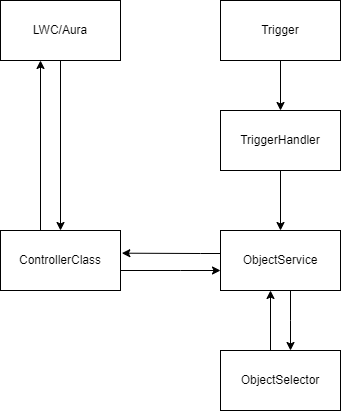

# <span style="text-align:center">Appsavio Coding Standards</span>

<br/><br/>

# Naming Conventions
- Use US-English for naming identifiers.

-  Use Pascal and Camel casing for naming identifiers.
In Pascal casing, the first letter of each word in an identifier is capitalized. For example,
UserStory.
In Camel casing, only the first letter of the second, third, etc. word in a name is capitalized. for example, userStory.

<br/>

| IDENTIFIER| CASE | EXAMPLE |
|--|--|--|
|Class |Pascal |Account|
|Enum type |Pascal |Severity|
|Enum values |Pascal |Severity.Error|
|Field |camel |listItem|
|Final/Const field |Pascal |MaximumCount|
|Static field |Pascal |RedValue|
|Interface |Pascal |Idisposable|
|Method in Apex,  Java |camel |toString|
|Method in C# |Pascal |ToString|
|Parameter |camel |typeName|
|Property |Pascal |BackColor|
|Trigger |Pascal |SendEmailOnNewAccount|

<br/>

In Apex, primitive types such as String, Decimal are all classes. So they should be Pascal casing. 

- Do not use Hungarian notation or add any other type of identification to identifiers. <br/> Hungarian notation means to put the variable type prior to its name. For example: strName,  intAge. 

- Do not use an underscore in identifiers. <br/> Avoid using underscore "\_" in identifiers. It is deprecated in most companies. 
<br/>Exception In Apex, underscores exist in the name of every custom field and custom object as “\_\_c” or  “\_\_r”, and in a managed package. When you create a custom field/object, Remove the blank spaces in the name to avoid unnecessary underscores. In other words,  blank spaces could appear in the label, but not in the name. 

-  Name an identifier according to its meaning and not its type. Every Identifier should be meaningful. 

- Use a noun or a noun phrase to name a class, field, or property.
<br/>Classes, fields, and properties should be noun phrases.  
The name for a Visualforce page can either be a noun or verb phrase. 

- Use a verb or a verbal phrase to name a method or trigger. 
<br/>Methods and Triggers do actions, so they should be verbal phrases. 

- Suffix exception classes with Exception. 
Classes derived from Exception are special. They should have the suffix Exception.  For example, DmlException, AcceptLeadException, EsclateCaseException. 

- Suffix controller classes with Controller 
For example, AssignCaseToDealerController 

- Suffix test classes with Test, test class name will be Class Name + Test, For example, we have a controller named AssignCaseToDealerController, the test class name  is AssignCaseToDealerControllerTest 

- Use a plural noun to name a collection, For example,  
```java
Set<Id> accountIds = new Set<Id>(); 
```

<br/>

# Comments

-  Each class/trigger shall contain a header block. 

The description should include useful information about what it is, why you created it, and any  known issues or dependencies: 
```java
/**
* @description : Description of the class
* @author : Author Name
* @created Date : CreatedDate
* @last modified on : LastModifiedDate
* @Test class: Name of Test class for this class
**/
```
You can download the VScode extension named **[Salesforce Documenter](https://marketplace.visualstudio.com/items?itemName=HugoOM.sfdx-autoheader)**

- Use // for single line comments.  
Use // instead of /\* \*/ if the comments is a single line. 

- Comments shall be written in US English 

- Verbs in comments shall be of singular form in the third person. 

- Write necessary comments, not redundant or noisy. 
For example, everybody knows that is a default constructor: 
```java
public class Whatever{

   //default constructor  
   Public Whatever(){ 

   }
} 
```

- Separate class members and code sections with a blank line. Remove unnecessary blank lines. 
Blank lines are treated equally as comments. Use them to separate class members.  For example, each method should be separated by a blank line.  
If a method contains more than one operation, separate them with blank lines. Do remove unnecessary blank lines in your code. 

- Remove the commented lines from production.  
For some reason, we need to comment some lines out when coding Please remember to remove them before deploying them to production. 

- No need to comment if the code can explain itself. 

<br/>

# Coding style

- Put the opening brace “{“ to a new line. 
Java developers used to put the opening brace in the same line of the block definition, like: 
```java
public class Whatever{
   //not recommended  
}
```

This is not about right or wrong, but we make an agreement to put it to the next line, like:  

```java
public class Whatever
{ 
	//recommended  
} 
```
This rule applies to all kinds of code blocks, including class, method, property, if-else, while,  etc.

- Use blank spaces properly 

Use blank spaces properly as betrayed in the following table: 

|EXPRESSION |BLACK SPACE |EXAMPLE|
| :- | :- | :- |
|Arithmetical operator |1 |b + c|
|Assignment |1 |a = b + c|
|Comparison |1 |a >= b + c|
|Semi-colon |0 |a = b + c;|
|if/while |1 |if (a == b + c)|
|for loop |1 |for (i = 0; i < 100; i++)|
|Unary operator |0|<p>!bool </p><p>-i</p>|
|Increment/Decrement |0|<p>i++ </p><p>--i</p>|
|Ternary operator |1 |(a == null) ? 0 : a|
|Function call |0 |sendEmail(email);|
|Subscript |0 |array[0]|
|Automatic property |1|<p>String Name { get;  </p><p>set; }</p>|


**Example:**  

```java
a = b + c; // right  

a=b+c; // wrong  

a = b + c ; // wrong  

a = (a == null) ? 0 : a; // right  

a = (a == null)?0:a; // wrong  

for (i = 0; i < 10; i++) // right  

for(i=0;i<10;i++) // wrong  

for (i = 0; i < 10; i ++) // wrong 

a = -- b; // wrong  

a = --c; // right  

a = - b; // wrong  

a = -b; // right  

public String Name{get;set;} // wrong  
public String Name { get; set; } // right 
```
 
- SOQL and SOSL should be readable on the screen without much scrolling so make sure to separate lines in SOQL to make it more readable in a single glance.

- All flow control primitives (if, else, while, for, do, switch) shall be followed by a block, even if it is empty. 

Example: 
```java
If () {}
```

-  A Tab space should be of four spaces no more no less. Change your IDE settings to set the Tab spaces to Four.

<br/>

# SOQL Rules

- The SOQL keywords should be in UPPERCASE for example.

```java
[SELECT Id, Name FROM Account WHERE Website = 'Test'] //Recommended

[select Id, Name From Account where Website = 'Test'] 
//Not Recommended
```

- It is recommended to have a single query on an Object in a Single piece of code. The developer should get the records to be used at once and store them in containers accordingly. 

- The Query should contain a valid *Where clause* condition to minimize the records returned from the query. The more records Query returns the more time Apex transaction will take. Also, there's a limit of 50000 records returned per Query. So it's better to filter data as much as possible in the Query itself.

- It is not recommended to store the Query resulted records in a list directly if there can be lots of records. It will impact the heap size and may terminate the transaction. A better way would be to use Query as the Value parameter of the forEach loop.

```java
//Not Recommend
List<Account> acctList = [SELECT Id FROM Account]; 
for( Account acct : acctList ){
	//Process here
}


//Recommend
for( Account acct : [SELECT Id FROM Account] ){
	//Process here
}
```

 - Avoid querying fields that are of no use for your logic. It will increase the Transaction time and Heap memory with unnecessary data.
 
 - Utilize child queries instead of Querying child records in another Query.

```java
//Not Recommend
List<Account> acctList = [ SELECT Id, Name FROM Account ];
List<Opportunity> oppList = [ SELECT Id, Name 
			      FROM Opportunity 
			      WHERE Account Id IN: acctList];		

//Recommend
List<Account> acctList = [ SELECT Id, Name
			 ( SELECT Id FROM Opportunities )
			   FROM Account ];
```

 - Maintain the spaces

```java

//Recommend
[ SELECT Id, Name FROM Account Where Id IN: keySet() ];

//Not Recommend
[SELECT Id,Name FROM Account Where Id IN:keyset()];

```

## Enterprise Structure

To keep the code sophisticated and easy to maintained developers should write their code in a well-mannered structure that will keep the different parts of the at their appropriate places. 

The General structure for coding is below:




## Trigger
The Apex Trigger should contain only the Trigger session logics ( After, Before, Insert Update ). It should not contain any business-related logic. Based on different sessions the trigger should call the methods or the TriggerHandler class.

```java
trigger TriggerAccount on Account{

	if( Trigger.isBefore ){
		if( Trigger.isInsert ){
			AccountTriggerHandler.setAccountAge( Trigger.Name );
		}
	}
	if( Trigger.isAfter ){
		if( Trigger.isInsert ){
			AccountTriggerHandler.createAccountContacts( Trigger.Name );
		}
	}
		

}
```

## TriggerHandler
To handle the Data to be inserted or modified developers should create a TriggerHandler class. TriggerHandler should have separate methods for each functionality and should be called from Trigger inappropriate conditions.  TriggerHandlers should call the methods from the Object Specific Service Class method that contains all the business logic. It is not recommended to have any DML in TriggerHandler class. An example of TriggerHandler is as follows:

```java
public class AccountTriggerHandler{
	
	public static void setAccountAge( List<Account> newAccounts ){
		List<Account> acctList = new List<Account>();
		for( Account acct : newAccounts ){
			if( acct.Email != null ){
				acctList.add( acct );
			}
		}
		AccountService.setAccountAge( acctList );
	}
	
	public static void createAccountContacts( List<Account> newAccounts ){
		AccountService.createAccountContacts( newAccounts );
	}
}
```

## ObjectService class
The Object Service class contains all the business logic for the object. This class is named after the sObject name. For example, AccountService will contain all the logic for happening on the Account object same for other standard and custom objects. This makes it easy to find and resolve the issues and also keeps the code clean and structured. An example of a Service class is given below:

```java
public class AccountService{
	
	public static void setAccountAge( List<Account> newAccounts ){
		//Business logics here
	}
	
	public static void createAccountContacts( List<Account> newAccounts ){
		//Business logics here
	}
}
```

## ObjectSelector class
The selector classes contain all the queries for the specific objects. For example, the AccountSelector class will contain all the SOQL happening on the Account object in this org. Then this method should be called from different classes. This class layer helps to detect the Governer limits spend and resolve them. It helps developers to monitor easily which queries they are using and also helps in Code reusability. An example for Selector class is as follows.

```java
public class AccountSelector{

	//Following method can be called from Service or Controller class.
	public static List<Account> getAccountsById( Set<Id> accIds ){
		return [ SELECT Id, Name, Website FROM Account WHERE Id IN: accIds ];
	}	

}
```

## Controller class
Controller classes are created specifically for Lightning Components and Vifsualforce pages. These classes contain the component-specific logic but as far as business-related logic is considered controller classes call the methods from the Service classes to perform DML on records. It is not recommended to have DMLs in Controller classes. Following is an example for the Controller class structure.

```java

public class AccountPageController{
	
	@AuraEnabled
	public static List<Account> getAccountDetails( Set<Id> accIds ){
		return AccountSelector.getAccountsById( accIds );
	}

	@AuraEnabled
	public static void updateAccounts( List<Account> acctList ){
		AccountService.updateAccounts( acctList );
	} 

}

```

# Trigger Standards

- Keep the one Trigger per Object structure. Create a Trigger Handler class that further processes the business logic.

- Keep Trigger clean. Keep as less logic as possible inside the Trigger file and move all logic into TriggerHandler and Service classes.

- Triggers must be Bulkified. Every method called from your trigger should expect multiple records to be processed. This will ensure Trigger functionality when bulk loading of data.

- Trigger Name should follow Naming conventions like:

> 'Trigger'+ObjectName<br/>
>  For Example TriggerOpportunity or TriggerAccount

- The trigger should have separate If sections for each session. For example

```java

if( Trigger.isBefore ){

	if( Trigger.isInsert ){
		//Call all Before Insert Methods here
	}

	if( Trigger.isUpdate ){
		//Call all Before Insert Methods here
	}

	if( Trigger.isDelete ){
		//Call all Before Insert Methods here
	}

}

if( Trigger.isAfter ){

	if( Trigger.isInsert ){
		//Call all After Insert Methods here
	}

	if( Trigger.isUpdate ){
		//Call all After Insert Methods here
	}

	if( Trigger.isDelete ){
		//Call all After Insert Methods here
	}

}

```

- For Projects with a bunch of Triggers it is recommended to utilize this [Trigger Framework](https://github.com/kevinohara80/sfdc-trigger-framework).
This will keep the Trigger logic easier to implement and maintain.

- It is recommended to have custom settings to disable and enable the Triggers manually or programmatically.


